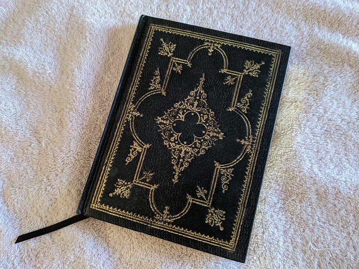

At the end of the work day, how do you know what you've accomplished? Who you spoke to? What decisions were made? I've found that keeping a work journal helps me keep perspective while also serving as a vital record of the conversations I have every day.

## Find a format that works for you

It's up to you what your journal will look like. I like a small, hardcover diary type book. That way I have something that feels special and can survive bouncing around my bag. But, I've met people who used a paperback notebook, a Day-Timer, or even the Windows notepad app. The form your work journal takes isn't as important as:

* updating it consistently
* writing neatly so you can refer to it later
* recording pertinent details like who you made decisions with
* extracting a list of *to-dos* or *action items* for follow-up

I'm fresh in a new role, so Monday was about getting settled in and opening a million Service Desk tickets. I recorded each of those tickets so I could see what I've already asked for access to and which ones to follow up on.

I track my progress in online classes so can see if they were worth my money. I also track the training videos needed when joining a new company, webinars I attend, and conference talks I pull up on YouTube.

I record detailed notes from 1:1's with my Director, but I only mention 1:1s with my direct reports. Notes from those meetings may include personal details or performance concerns, so I keep them in a secure place.

I track meetings I attend and any decisions made there.

I track tasks I work on and code reviews I perform.

I use two colors of ink, black and purple, to draw attention to margin notes, action items, and other special details. It also makes journaling more fun, so I'm more likely to do it every day.

Lastly, I run a highlighter over the date because a day's notes can span a couple pages and I may need to find a certain day quickly.

This is what works for *me*, and you'll find what works best for you through trial and error. Don't give up if you don't come up with a perfect system right away. Make small changes until you've got a system that keeps you productive and is unmistakably you!

## Update it throughout the day
You carry your phone almost everywhere at work. Your work journal should come along too! Use it to record meetings you attended or important hallway conversations. Did you stop to water the plants? Did you notice a teammate who looked stressed and check in with them? Write those things down too!

The other day, I sat down to eat lunch and I felt terrible, like I hadn't accomplished a single thing all day. I opened my work journal and realized I'd filled up half a page with training videos and new-hire paperwork already! It really gives you a complete picture of everything you squeeze into a work day.

You'll also be able to refer back to it when questions come up. Who had that great idea that saved your bacon today? You chatted about it with Fran while waiting for coffee on the 12th. Was John in the big meeting yesterday? No, John was at his son's violin recital.

## Finish today by planning tomorrow

You should take time to set your future self up for success.

Block off 15-30 minutes at the end of every work day to review your journal and see what warrants a follow-up. I like to write these *action items* in my work journal so there's a clear relationship between the to-do and what prompted it. But be sure to put these reminders in your paper planner or to-do app as well!

Action items can include things like:
* following up on something you talked about
* discussing a teammate's concern with the right stakeholders
* signing up for additional training on something you noticed you need help with
* taking it easy tomorrow because today was so hectic

This is an important moment for reflection and planning. Approach it with the same seriousness as any other part of your work. Look at it as an investment in tomorrow's success.

## Give it a try!

You don't need an expensive notebook or fancy app to start keeping your own work journal. Start simple with a single sheet of paper until you figure out what helps you stay on-track and inspired. I hope you find a journal that works for you!