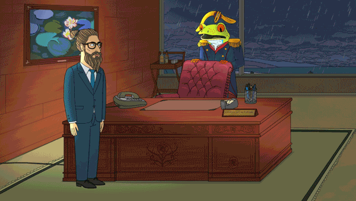
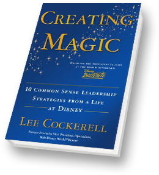
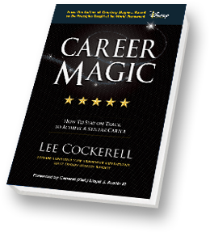
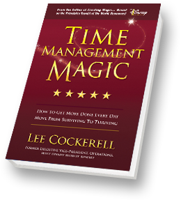
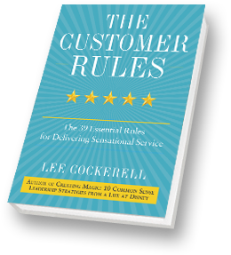

## What is this?

This is a description of what I’m all about and my philosophies about what being a team is about.

## What this is not:

This is NOT a pile of excuses for my bad behavior. This is not me trying to make my personality quirks into your problems because “well, I warned you about that in my README”.

Camille Fournier has a great blog post called [I hate manager READMEs](https://medium.com/@skamille/i-hate-manager-readmes-20a0dd9a70d0) that sums up how I feel about how these kinds of things tend to turn out.

## About Me
My pronouns are [she/her](http://pronoun.is/she/her) .

I was born in Chicago and moved to Boston in 2012.

My wife is a bioengineer and got a job out here, so we packed up all our stuff, sold our house, and drove half-way across the country in a hatchback with three cats!

My son was born in 2016. He’s the kindest, smartest, cutest kid ever born.

I’ve been involved in volunteer animal rescue for about fifteen years, with a focus on socializing feral, shy, and abused cats. We have two cats of our own now, both formerly feral and both very cuddly and spoiled.

I got my first programming job in 1999, and I’ve been in management roles for about six years. I spent over a decade in the web agency world.

I grew up with Apple IIs and Commodore 64s, and I still love tinkering with vintage technology which you’ll often see behind me on Zoom calls in various states of disassembly.    

My favorite color is orange. At least for this week.

I love Star Trek. I miss Firefly. BoJack Horseman cracks me up and then hits a little too close to home sometimes.

<video autoplay loop muted playsinline role="presentation">
    <source src="../images/being-a-boss.mp4" type="video/mp4">
    
    <!-- Animated: A frog in a Napoleon style uniform falls across a desk. Caption is 'being a boss is hard'. -->
</video>

Music? Pretty much anything but mostly 90s industrial, 90s-2000s EBM, Electro-swing, and Synthwave.

I use Android but I’m still mourning Windows Phone.

I run 5k, 10k, and half marathon races, although not as much or as fast as I did before my
    kid was born.

## Contacting Me
You'll get my personal cell phone number the day you join my team. I don’t usually answer my phone, but if it’s urgent you can leave a voicemail and I’ll get back to you.

I check my work email & personal email constantly on my phone, even outside of work hours. That doesn’t mean I expect you to do that too, or that I will get back to you before the start of the next day. It just means I have bad FOMO.

I may not respond to your Slack message until the following day, either.

If a message from me needs an urgent response, I’ll tell you. Otherwise, assume it can wait until you have a moment to review what I'm saying and give it the appropriate amount of thought before responding. And if it's after hours (and not urgent), I can wait until you get settled into your next work day.

## My Values
### Family
Whether they're family by blood or family by choice, the people close to me are a priority for me, as I hope the people close to you are for you.

### Physical and Mental Health
I don’t want anyone on this team burning themselves out or neglecting their health. That means no 60 hour weeks where you’re really productive on paper but you can’t get anything done. Shoot for a 40 hour week average. Finish work at a decent time. Eat good food. Have hobbies. Exercise. Sleep.
<figure>
    <picture>
        <source srcset="../images/what-makes-me-productive.webp" type="image/webp">
        <source srcset="../images/what-makes-me-productive.png" type="image/png">
        
    </picture>
    <figcaption>Cartoon by <a href="https://twitter.com/lizandmollie"
            rel="nofollow">@lizandmollie</a></figcaption>
</figure>

### Diversity
There’s a wide variety of people out there, and we do ourselves a disservice if we don’t actively seek to bring new ideas, viewpoints, and experiences into our team. Prejudice and bias not only rob others of a fair chance at a happy work life, they rob us of their unique contributions to our technical potential and culture. They have no place in a 21st century workplace.
<blockquote class="twitter-tweet">
    
Our differences are what make us great… and bring us together. Take it from me, a frog who has spent a lot of time getting together with a lot of very different, uh, whatevers.&mdash; Kermit the Frog (@KermitTheFrog) <a href="https://twitter.com/KermitTheFrog/status/1196843077853417474?ref_src=twsrc%5Etfw">November 19, 2019</a>
</blockquote>

### Respect
We usually don’t get to pick our co-workers. We all need to find common ground, work together and not get in the way of anybody else getting their work done. That means personal respect, respecting boundaries, and acting like grown-up professionals here to do a job.

### Growth
You ever hear that joke that goes?:
> Manager: We need to increase our training budget.  
> CEO: What if we spend all this money on our people and they leave?  
> Manager: What if we don’t invest in them and they STAY?

As your manager, I have a personal investment in your success. It helps you grow as an individual. It helps our team deliver new and innovative solutions. It helps the company as a whole to meet and exceed our goals. Your success is my success, both in real terms of job security and in the pride of watching you grow.

I hope you will take advantage of the resources the company and I make available to you, and I will regularly check in with you to make sure you’re setting aside time to learn new things appropriate to the work you do. I also hope you will make time outside work to invest in yourself.

This isn’t limited to learning new programming languages and technologies. Growing in so-called “soft skills” will pay big dividends in your career as well. Pick up a foreign language! Learn public speaking! Learn to cook!

## One on Ones
You'll find a weekly 1:1 meeting with me on your calendar, and there should be a link to an agenda document in the description.

1:1s are a chance to step back from our usual work and focus on bigger topics. I'll usually bring a thing or two related to your recent performance, how everyone is working as a team, or maybe some changes coming soon for our team.

But, really, this meeting is supposed to be about you. So go ahead and drop a couple things on the agenda you want to talk about! You've got me for 30 minutes. Let's talk about:
* Challenges you're facing at work or things you just find frustrating, annoying, or just plain obnoxious.
* How you want to grow in your current role and your career in general.
* How to get better at Slack, time management, communication, and other critical components of remote work.
* How our team can work together more effectively.

## Feedback
I am not a *servant leader*. I’m here to encourage you, to challenge you, and to eliminate the barriers that keep you from making amazing things happen here. But while I may be friendly, I’m not your friend. And while I’m at all the team’s meetings, from standups to gaming time, I’m not a member of the team. I’m your manager, and I’m not doing you a favor if I pretend otherwise, especially if the only reason is to make myself more comfortable with the power disparity between us.

> Here’s the thing, though. Servants don’t fire the people they serve, and you do. Servants don’t set salaries for the people they serve, and you do. Servants don’t approve vacations, assign work, or shut down the toxic behaviours of the people they serve.  
> <cite>[We Need to Talk About Servant Leadership](https://mfbt.ca/we-need-to-talk-about-servant-leadership-a719c4c05434)</cite>

As your manager and someone invested in your success, I may have to deliver honest feedback to you that’s not always the best thing to receive.

**You have my word that any feedback of this nature will be delivered discreetly and respectfully**, with a goal of building you up into the team members we need, and never to tear you down.

I’m a believer in Performance Improvement Plans (PIPs). PIPs have a reputation as something negative. They’re seen as a way to “manage out” employees that bosses don’t have the guts to fire outright.

A PIP should never be used like that. Why even go through the motions and waste everyone’s time if you just want to get rid of someone? Instead, **I try to give direct feedback, mentoring, and enough time to achieve the goals we set before you.** The structure of the PIP forces us to regularly reflect on your progress, and to meet regularly to discuss it. It’s a way to ensure you get the support you need to thrive, because we want you to continue being part of our team.

## Code
I like code that works.

I like readable code. If you can make a function pure and still have it make sense to everyone else, of all skill levels, then that’s great. But don’t try to fit critical code in a pure one-liner just to show off. This isn’t PERL.

I like inline documentation. JSDoc & PHPDoc are awesome. So are comments that explain the reason code works a certain way or some non-obvious requirement it’s meant to address. I don’t like comments that tell what the code does, as the code itself should be clear enough to convey that.

This is a job. We’re here to deliver value and to make it easy for our customers to buy products they trust and enjoy. It's how we make money, both as individuals and as a company. **Let’s not lose sight of this fact, and strive for balance between academically perfect code and delivering quickly.**

Lastly, if you have a computer science degree, I want you to question everything you learned. A lot of the canonical algorithms you were taught in college are designed for a world of single core CPUs clocked in MHz, scarce RAM, and slow secondary storage, and when *Big Data* was a couple hundred thousand records. Consider how you can best take advantage of today's technology in the things you build. We're swimming in a sea of abundant compute & storage resources. Consider how much the "best" solution saves in actual time on the clock vs the burden it might put on your fellow engineers to understand & maintain it. Consider if you can throw more inexpensive CPU cores at a problem for the cost of a burrito. That's not saying I'll excuse inefficient code, but I also don't want to see us fussing over a few cycles of performance with no real-world value.

## Agile
I have a Scrum Master Accredited Certification from the International Scrum Institute. That's not the same as a Certified Scrum Master certification, because that’s trademarked…and expensive.

My certification is the result of $50 loose change in my pocket and a little too much Grey Goose. It was an open book test and I could re-take it once. But I didn’t need to! I got a 48/50 and only looked up a couple answers.

That’s to say I know quite a bit about Scrum workflows and I even have a PDF to prove it and that makes me no more of an authority on what works than you. Because at the end of the day, the Scrum ceremonies don’t matter. They’re tools to make us more productive and give us a framework to collaborate as a team. **We need to throw away things that don’t work for us today, double down on the things that do work, and try new things to see if they will work going forward.**

**We need to be agile about being Agile.**

## Inspiration
I’m a huge fan of [Lee Cockerell](https://www.leecockerell.com/), former Executive Vice President of Operations for the Walt Disney World Resort. Lee worked his way up from waiting tables at a hotel, to running food & beverage departments, to running hotels, and then went on to Disney where he was critical to the launch and eventual success of Disneyland Paris and then Disney World in Florida. While there, he over saw a company-wide transition from top-down “command and control” leadership to a modern style of trust and distributed decision making authority.

He was at the helm of the Disney World resort through two hurricanes and the terrorist attack of 9/11.

He’s now a public speaker and author on leadership. His books are invaluable to me, and I encourage you to seek them out whether you’re in a management role or not, and to bring out the leader within you.

<ul class=books>
    <li><a href="https://www.amazon.com/Creating-Magic-Common-Leadership-Strategies/dp/0385523866/"
            rel=nofollow>
            <picture>
                <source srcset="../images/creating-magic-book.webp" type="image/webp">
                <source srcset="../images/creating-magic-book.png" type="image/png">
                
            </picture>
        </a>
    </li>
    <li><a href="https://www.amazon.com/Career-Magic-Track-Achieve-Stellar/dp/1943127328/"
            rel=nofollow>
            <picture>
                <source srcset="../images/career-magic-book.webp" type="image/webp">
                <source srcset="../images/career-magic-book.png" type="image/png">
                
            </picture>
        </a>
    </li>
    <li><a href="https://www.amazon.com/Time-Management-Magic-Surviving-Thriving/dp/0990769461/"
            rel=nofollow>
            <picture>
                <source srcset="../images/time-management-magic-book.webp" type="image/webp">
                <source srcset="../images/time-management-magic-book.png" type="image/png">
                
            </picture>
        </a>
    </li>
    <li><a href="https://www.amazon.com/Customer-Rules-Essential-Delivering-Sensational/dp/0770435602/"
            rel=nofollow>
            <picture>
                <source srcset="../images/the-customer-rules-book.webp" type="image/webp">
                <source srcset="../images/the-customer-rules-book.png" type="image/png">
                
            </picture>
        </a>
    </li>
</ul>
